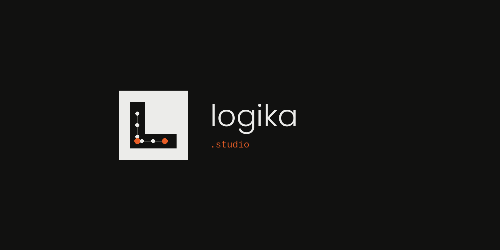

<p align="center">
  <picture>
    <source media="(prefers-color-scheme: dark)" srcset=".github/logika-dark.png" />
    <source media="(prefers-color-scheme: light)" srcset=".github/logika-light.png" />
    
  </picture>
</p>

<h1 align="center">🧰 dev-templates</h1>

<p align="center">
  <strong>Templates listos para producción, reutilizables y open source.</strong><br/>
  Copia · Reemplaza los placeholders · Publica 🚀
</p>

<p align="center">
  
  
  
  
  
</p>

<p align="center">
  <a href="./README.md">🇮🇹 Italiano</a> ·
  <a href="./README.en.md">🇬🇧 English</a> ·
  <a href="./README.fr.md">🇫🇷 Français</a> ·
  <a href="./README.de.md">🇩🇪 Deutsch</a> ·
  <strong>🇪🇸 Español</strong>
</p>

---

## 💡 ¿Por qué este repo?

Cada vez que inicias un nuevo proyecto web, terminas reescribiendo los mismos componentes: **páginas legales**, **banner de cookies**, **footer**, **formularios de contacto**…

**dev-templates** resuelve esto. Es una colección de templates **listos para usar**, probados en producción, que puedes copiar en cualquier proyecto Next.js y personalizar en minutos.

| | Ventaja |
|:-:|---------|
| ⏱️ | **Ahorra tiempo** — deja de reescribir las mismas páginas para cada cliente |
| ✅ | **Calidad de producción** — cada template ha sido usado en proyectos reales |
| 🌍 | **Open source** — úsalo gratis, contribuye si quieres, compártelo |
| 🔤 | **Sistema de placeholders** — un simple buscar-y-reemplazar adapta todo a tu marca |

---

## 📦 Templates disponibles

| | Template | Contenido | Stack |
|:-:|----------|-----------|-------|
| 🛡️ | **[legal-pages](./legal-pages/)** | Páginas legales RGPD + banner de cookies bloqueante con consentimiento granular | Next.js · Tailwind · Framer Motion |

> 🔜 **Más templates próximamente.** ¿Tienes una idea? [Abre un issue](../../issues) o un PR!

---

## 🚀 Quick Start

```bash
# 1️⃣  Clona el repo
git clone https://github.com/LuigiGarone/open-source.git

# 2️⃣  Copia el template que necesites en tu proyecto
cp -r open-source/dev-templates/legal-pages/components/ tu-proyecto/src/components/marketing/
cp -r open-source/dev-templates/legal-pages/pages/       tu-proyecto/src/app/(marketing)/

# 3️⃣  Reemplaza los placeholders (ver README de cada template)
```

---

## 🤝 Contribuir

¿Encontraste un bug o quieres agregar un template? ¡Los PR son bienvenidos!

1. 🍴 Haz un **fork**
2. 🌿 Crea un **branch**
3. 📬 Abre una **Pull Request**

---

## 📜 Licencia

**MIT** — libre para uso personal y comercial.

---

<p align="center">
  <picture>
    <source media="(prefers-color-scheme: dark)" srcset=".github/logika-dark.png" />
    <source media="(prefers-color-scheme: light)" srcset=".github/logika-light.png" />
    
  </picture>
  <br/>
  <sub>Hecho con ❤️ por <a href="https://logika.studio">Logika.studio</a></sub>
</p>
